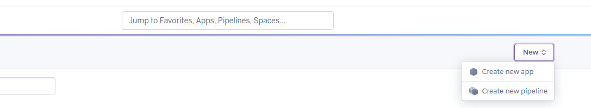
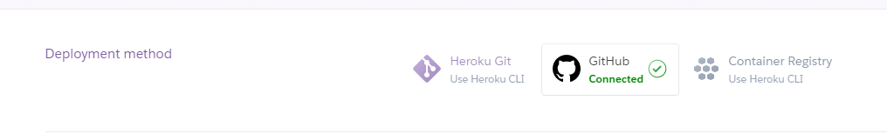
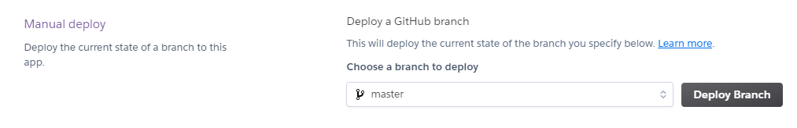

[Fitness For All](https://fitness-for-all.herokuapp.com/)

## Contents ##
---

* UX
    * [Introduction](#introduction)
    * [User Stories](#user-stories)
    * [Design](#design)
        * [Wireframe](#design)
        * [Database](#design)
        * [Fonts](#fonts)
        * [Icons](#icons)
        * [Colours](#colours)

* [Features](#features)
* [Technologies](#technologies)
* [Testing](#testing)
* [Deployment](#deployment)
* [Credit](#credits)

## Introduction ##

Fitness For All is an online gym, that offers all users an online shop containing excerise clothing, equipment and nutritional food supplements and snacks. If a user would like to save their order history and basket, they can signup for free membership or full paid membership, which will additontally grant users access to workout videos, discounts in the shop, online 1 to 1 sessions with coaches and access to member profiles and blogs.

The site also has built in managment functiounality which provides admin users with the abilty to add, remove and update products and workouts.

## UX (User Experience) ##
---

### User Stories ### 

As a user I would like to:

* Have access to exercise and nutrition products
* See what the site has to offer before becoming a full member
* As a full member I would like to:
  * Get discounts for products
  * See order history
  * Have access to a variety of workout videos
  * Be able to view specific workouts for different fitness goals
  * Have access to exercise and nutrition advice
  * Ability to share my progress and view other members progress 

As the site owner I would like to:

* Sell branded exercise products
* Sell Nutritional products
* Manage products
* Manage workout videos

## Design  ##
---

### Wireframes ###

The webite was initially designed using [balsamiq](https://balsamiq.com/) to create wireframes representing the site structure. See link below for details

* [Desktop](documentation/wireframes/desktop.md)
* [Tablet](documentation/wireframes/tablet.md)
* [Mobile](documentation/wireframes/mobile.md)

### Database ###
I used [dbdiagram.io](https://dbdiagram.io/d) to design the database structure and relations ships

### **Fonts** ###

In order to create the feeling of modern concept of an online only gym, I chose the following font from Google fonts.

* Gruppo cursive

### **Icons** ###

The following sites were used for icon creation

* [Font Awesome](https://fontawesome.com/)
* [Favicon.io](https://favicon.io/).

### **Colours** ###

The colours chosen for this site are predominantly various shades of green to represent health.

## Features ## 
---

**Navigation bar**

* Not signed in Nav Bar

* Signed in Standard User Nav Bar

* Full Member Nav Bar

&nbsp;

**Shop**

* Product search - with filter for product categories and sort by price and name

* Add to basket section on Product detail with quantity selector

* Basket - link

&nbsp;

**Basket Page**

&nbsp;

**Checkout**

* Integrated Stripe payments

&nbsp;

**Workouts**

* Workout videos with category filter

&nbsp;

**Member Blog**

* Member blog page with link to add blog

&nbsp;

**Profile Page**

* Profile Page with tabs for Public profile, Full Profile and Order History

**Site Admin**

* Admin users will have access to the following addiontal features

  * Edit and delete product buttons for each product on the shop page

    

  * Add product button on the shop page

    

  * Edit and delete workout buttons for each workout on the workouts page

    

  * Add workout button on the workouts page

    

&nbsp;
### **Defensive Programming** ###

* Sign out confirm 

* Delete Product confirm modal 

* Delete Workout confirm modal 

&nbsp;

## Technologies, libraries and tools used ##
---

* [Django](https://www.djangoproject.com/)
* [Bootstrap](https://bootstrap4.com/)
* [CSS](https://developer.mozilla.org/en-US/docs/Web/CSS)
* [Font-Awesome](https://fontawesome.com/)
* [Google fonts](https://fonts.google.com/)
* [HTML](https://developer.mozilla.org/en-US/docs/Web/HTML)
* [Javascript](https://www.javascript.com/)
* [favicon.io](https://materializecss.com/)
* [Flask](https://flask.palletsprojects.com/en/1.1.x/)
* [Jinja](https://jinja.palletsprojects.com/en/2.11.x/)
* [MongoDB](https://www.mongodb.com/1)
* [Python](https://www.python.org/)
* [Werkzeug](https://werkzeug.palletsprojects.com/en/1.0.x/)
* [Heroku](https://dashboard.heroku.com/)
* [Git](https://git-scm.com/)
* [Github](https://github.com/)
* [Gitpod](https://gitpod.io/)
* [dbdiagram.io](https://dbdiagram.io/d)

## Testing ##
---

Details of all tests that were performed can be found [here](documents/testing.md)

In order to test this site as admin you will need the following credentials:
* Username: ffa_admin
* Password: fitnessforall

### Issues identified and fixed ###

* Non editable form fields displayed on Edit Profile page
    * Issue correct by added the relevant fields to the exclude section of the Meta class in the Profiles form

In addition to the tests that were completed in the testing document, all code has been tested using the following code validators.

* [JSHint](https://jshint.com/) (JS file passed validator)
* [PEP8 online](http://pep8online.com/)
* [W3C HTML Validator](https://validator.w3.org/) (all pages passed validator)
* [W3C CSS Validator](https://jigsaw.w3.org/css-validator/) (css file passed validator)

## Deployment ##
---

### External account requirements ####

Fot this app to be fully functionally locally and on Heroku, the following are required.

* Valid email account with third party app access enabled
* stripe account with webhook configured for payment confirmation

### Local Deployment ###

* Open browser of choice.
* Copy/Paste the address of [Fitness For All](https://github.com/phil-griffith/fitness_for_all) in your search box.
* When on the page, click on the "Code" button.
* Copy the the [HTTPS Link](https://github.com/phil-griffith/fitness_for_all).
* Open your IDE and in your terminal, create a virtual environment supporting python and flask and activate it.
* Type "git clone" and paste the [HTTPS Link]https://github.com/phil-griffith/fitness_for_all).
* Setup environment variables and add to env.py or IDE
* Add your env.py to .gitignore. to avoid it being uploaded.
* In app.py, switch **debug=False** to **debug=True**
* Upgrade pip locally with the command "pip install -U pip".
* Install the modules used to run the application using "pip freeze > requirements.txt" in your terminal.
* Run Migrations to update the database
* You can now run your application locally by typing the command "python3 app.py" or "run app.py" in your terminal.
* You can visit the website at http://127.0.0.1:5000

## Deploying on Heroku

- Create AWS S3 Bucket (or similar) for static file storage and add details to settings.py

- Create a requirements.txt file using the command **pip3 freeze --local > requirements.txt** in your CLI.
- Create a Procfile (always with an uppercase P) through the command **echo web: python app.py > Procfile**. Commit and Push.
- Create an account on [**Heroku**](https://www.heroku.com/home).
- Create a new app (select nearest region).

    

- Link app to your **Github repository** in the **deployment** section.

     

- Navigate to Haroku Settings and set up the following in **Config Vars**
    
    * AWS_ACCESS_KEY_ID
    * AWS_SECRET_ACCESS_KEY
    * AWS_SECRET_KEY_ID
    * DATABASE_URL
    * EMAIL_HOST_PASS
    * EMAIL_HOST_USER
    * SECRET_KEY
    * STRIPE_PUBLIC_KEY
    * STRIPE_SECRET_KEY
    * STRIPE_WH_SECRET
    * USE_AWS

- Add Heroku Postgres for the database and add details to settings.py
  Note this will require migrations to be run

* Go back to the Deploy section, select the master branch and deploy the project. 

    

## Credits ##
---

* CODE
    * The code and design for the Sign in, Registration and Shop is largely based on the Code Institute Project (Boutique Ado)

* Shop items
  * Clothes
    * https://www.sports-fitness.co.uk/joma-vest-womens-yellow-record-ii-jwrrvy
    * https://www.sports-fitness.co.uk/joma-vest-girls-green-kids-jgkrvg

    * https://www.sports-fitness.co.uk/running/clothes/men/new-balance-mens-black-impact-run-5inch-shorts-nbmbir5ish
    * https://www.sports-fitness.co.uk/running/clothes/men/new-balance-mens-blue-impact-run-tshirt-nbmbirts
    * https://www.sports-fitness.co.uk/new-balance-womens-accelerate-colorblock-tights-nbwacbt

    * https://www.sports-fitness.co.uk/new-balance-mens-rwt-lightweight-woven-jacket-nbmrwtlwwja
    * https://www.sports-fitness.co.uk/new-balance-tenacity-dark-teal-training-t-shirt-nbdttt
  * Equipement
    * https://www.fitness-superstore.co.uk/body-power-sp-ic20-indoor-studio-cycle.html
    * https://www.fitness-superstore.co.uk/jordan-fitness-6kg-cast-iron-kettlebell-1.html
    * https://www.fitness-superstore.co.uk/body-power-65kg-olympic-dumbbell-set.html
    * https://www.fitness-superstore.co.uk/body-power-85kg-tri-grip-olympic-weight-set-6ft-bar.html
    * https://www.fitness-superstore.co.uk/bowflex-xtreme-2-se-home-gym.html
    * https://www.fitness-superstore.co.uk/bh-fitness-pioneer-r3-tredamill.html
    * https://www.fitness-superstore.co.uk/bh-fitness-mycron-c170-cross-trainer-with-bluetooth-i-concept-technology.html
  * Accessories
    * https://www.fitness-superstore.co.uk/body-power-48-x-36-floor-protector-mat.html
    * https://www.fitness-superstore.co.uk/bowflex-bluetooth-armband.html
    * https://www.fitness-superstore.co.uk/body-power-gym-ball-55cm-grey.html
    * https://www.fitness-superstore.co.uk/bodypower-mini-bands-set-of-4.html
    * https://www.fitness-superstore.co.uk/bodypower-mini-bands-set-of-4.html
    * https://www.fitness-superstore.co.uk/fitness-mad-blaster-pump.html
    * https://www.fitness-superstore.co.uk/reebok-step-1.html
  * Nutrition
    * https://www.myprotein.com/sports-nutrition/protein-brownie/11094927.html
    * https://www.myprotein.com/sports-nutrition/vegan-vitamin-d3-softgels/11536717.html
    * https://www.myprotein.com/sports-nutrition/creatine-monohydrate-tablets/10575029.html?autocomplete=productsuggestion
    * https://www.myprotein.com/sports-nutrition/pure-caffeine-tablets/10529801.html?autocomplete=productsuggestion
    * https://www.myprotein.com/sports-nutrition/all-natural-peanut-butter/10530743.html?autocomplete=productsuggestion
    * https://www.myprotein.com/sports-nutrition/vegan-protein-blend/11776868.html

* Workout Videos
    * https.wwww.youtube.com

I would also like to thank my Mentor Aaron Sinnot for all of his advice and my family and friends for testing the site for me
