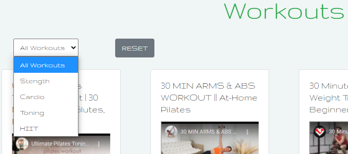

[Fitness For All](https://fitness-for-all.herokuapp.com/)

## Contents ##
---

* UX
    * [Introduction](#introduction)
    * [User Stories](#user-stories)
    * [Design](#design)
        * [Wireframe](#design)
        * [Database](#design)
        * [Fonts](#fonts)
        * [Icons](#icons)
        * [Colours](#colours)

* [Features](#features)
* [Technologies](#technologies)
* [Testing](#testing)
* [Deployment](#deployment)
* [Credit](#credits)

## Introduction ##

Fitness For All is an online gym, that offers all users an online shop containing excerise clothing, equipment and nutritional food supplements and snacks. If a user would like to save their order history and basket, they can signup for free membership or full paid membership, which will additontally grant users access to workout videos, discounts in the shop, online 1 to 1 sessions with coaches and access to member profiles and blogs.

The site also has built in managment functiounality which provides admin users with the abilty to add, remove and update products and workouts.

## UX (User Experience) ##
---

### User Stories ### 

As a user I would like to:

* Have access to exercise and nutrition products
See what the site has to offer before subscribing
	As member
		Get discounts for products
		See order history
		Have access to a variety of workout videos
		Be able to view specific workouts for different fitness goals
		Nutrition advise and assitance with creating a nutrition plan
		Ability to share my progress and view other members progress 

In addition to these options, as the admin user I would like:

* To be able to Edit search categories
* To be able to Edit all recipes

As the site owner I would like to:

* Sell branded exercise products
* Sell Nutritional products
* Encourage customers to join by providing:
  * Discounted products
  * Full access to workout videos
  * Access to instructor coaching
  * Abilty to view member progress updates
  * Abilty to share personal progress updates
* Manage members access
* Manage products
* Manage workout videos

## Design  ##
---

### Wireframes ###

The webite was initially designed using [balsamiq](https://balsamiq.com/) to create wireframes representing the site structure. See link below for details

* [Desktop](documentation/wireframes/desktop.md)
* [Tablet](documentation/wireframes/tablet.md)
* [Mobile](documentation/wireframes/mobile.md)

### Database ###
I used [dbdiagram.io](https://dbdiagram.io/d) to design the database structure and relations ships

### **Fonts** ###

In order to create the feeling of modern concept of an online only gym, I chose the following font from Google fonts.

* Gruppo cursive

### **Icons** ###

The following sites were used for icon creation

* [Font Awesome](https://fontawesome.com/)
* [Favicon.io](https://favicon.io/).

## Features ## 
---

**Navigation bar**

* Not signed in Nav Bar

* Signed in Standard User Nav Bar

* Full Member Nav Bar

&nbsp;

**Shop**

* Product search - with filter for product categories and sort by price and name

* Add to basket section on Product detail with quantity selector

* Basket - link

&nbsp;

**Basket Page**

&nbsp;

**Checkout**

* Integrated Stripe payments

&nbsp;

**Workouts**

* Workout videos with category filter

&nbsp;

**Member Blog**

* Member blog page with link to add blog

&nbsp;

**Profile Page**

* Profile Page with tabs for Public profile, Full Profile and Order History

**Site Admin**

* Admin users will have access to the following addiontal features

  * Edit and delete product buttons for each product on the shop page

    

  * Add product button on the shop page

    

  * Edit and delete workout buttons for each workout on the workouts page

    

  * Add workout button on the workouts page

    

&nbsp;
### **Defensive Programming** ###

* Sign out confirm 

* Delete Product confirm modal 

* Delete Workout confirm modal 

**Sign In**

* Incorrect username or password entered

**Register**

* Incorrect confirm password entered

&nbsp;

&nbsp;

## Technologies, libraries and tools used ##
---

**Front-End**
* [Bootstrap](https://bootstrap4.com/)
* [CSS](https://developer.mozilla.org/en-US/docs/Web/CSS)
* [Font-Awesome](https://fontawesome.com/)
* [Google fonts](https://fonts.google.com/)

* [HTML](https://developer.mozilla.org/en-US/docs/Web/HTML)
* [Javascript](https://www.javascript.com/)

* [materializecss](https://materializecss.com/)
* [favicon.io](https://materializecss.com/)

**Back-end**
* [Flask](https://flask.palletsprojects.com/en/1.1.x/)
* [Jinja](https://jinja.palletsprojects.com/en/2.11.x/)
* [MongoDB](https://www.mongodb.com/1)
* [Python](https://www.python.org/)
* [Werkzeug](https://werkzeug.palletsprojects.com/en/1.0.x/)

**Deployment**
* [Heroku](https://dashboard.heroku.com/)
* [Git](https://git-scm.com/)
* [Github](https://github.com/)
* [Gitpod](https://gitpod.io/)
* [dbdiagram.io](https://dbdiagram.io/d)

## Testing ##
---

Details of all tests that were performed can be found [here](documents/testing.md)

In order to test this site as admin you will need the following credentials:
* Username: admin
* Password: Password1

### Issues identified and fixed ###

* Incorrect Recipes deleting & Removing from Favourites
    * Issue was caused by a modal generation in for loop taking the same ID for every modal. Fixed by appending {{ loop.index }} to modal id
* Change Password modal trying to flash messages to deleted my account page
    * Fixed by changing modal to a Change password page where flash message can be displayed until password is successfully changed and then redirect to Home page

In addition to the tests that were completed in the testing document, all code has been tested using the following code validators.

* [JSHint](https://jshint.com/) (JS file passed validator)
* [PEP8 online](http://pep8online.com/)
* [W3C HTML Validator](https://validator.w3.org/) (all pages passed validator)
* [W3C CSS Validator](https://jigsaw.w3.org/css-validator/) (css file passed validator)

## Deployment ##
---

### Local Deployment ###

* Open browser of choice.
* Copy/Paste the address of [World Recipes](https://github.com/phil-griffith/world_recipes) in your search box.
* When on the page, click on the "Code" button.
* Copy the the [HTTPS Link](https://github.com/phil-griffith/world_recipes).
* Open your IDE and in your terminal, create a virtual environment supporting python and flask and activate it.
* Type "git clone" and paste the [HTTPS Link](https://github.com/phil-griffith/world_recipes).
* Create an environement file called "env.py" and add :
    - MONGO_URI=mongodb+srv://...
    - SECRET_KEY= [Your Secret key]
* Add your env.py to .gitignore. to avoid it being uploaded.
* In app.py, switch **debug=False** to **debug=True**
* Upgrade pip locally with the command "pip install -U pip".
* Install the modules used to run the application using "pip freeze > requirements.txt" in your terminal.
* Create a MongoDB account and create a database called **"world_recipes"**.
* Add documtents to database collection as per [database design](#database)

* You can now run your application locally by typing the command "python3 app.py" or "run app.py" in your terminal.
* You can visit the website at http://127.0.0.1:5000

## Deploying on Heroku

- Create a requirements.txt file using the command **pip3 freeze --local > requirements.txt** in your CLI.
- Create a Procfile (always with an uppercase P) through the command **echo web: python app.py > Procfile**. Commit and Push.
- Create an account on [**Heroku**](https://www.heroku.com/home).
- Create a new app (select nearest region).

    

    

- Link app to your **Github repository** in the **deployment** section.

     

- Navigate to Haroku Settings and set up the following in **Config Vars**
    
    * IP
    * MONGO_DBNAME
    * MONGO_URI
    * PORT
    * SECRET_KEY
    * KEY

* Go back to the Deploy section, select the master branch and deploy the project. 

    

## Credits ##
---

* CODE
    * The code and design for the Sign in, Registration and Recipe forms is largely based on the Code Institute Mini Project (Task Manager)
    * Some of the logic for User Recipe likes and favourites was taken from [jinja.palletsprojects.com](https://jinja.palletsprojects.com/en/2.10.x/templates/#assignments)
    * CSS for the responsive text ellipsis effects for recipe cards was taken from [stackoverflow.com](https://stackoverflow.com/questions/33058004/applying-an-ellipsis-to-multiline-text)

* Recipes
    * https://www.bbcgoodfood.com/recipes/sausages-winter-veg-mash
    * https://www.bbc.co.uk/food/recipes/spaghetti_bolognese_with_23409
    * https://www.bbc.co.uk/food/recipes/hawaiian_pizza_48114
    * https://www.japancentre.com/en/recipes/1141-datemaki

* Home page images
    * https://www.pnas.org/content/116/37/18152.full
    * https://www.kcrw.com/culture/shows/good-food/sonoran-tortillas-korean-home-cooking-jet-ali-tila/making-korean-meals-at-home-is-easier-than-you-think-says-sohui-kim

I would also like to thank my Mentor Aaron Sinnot for all of his advice and my family and friends for testing the site for me
